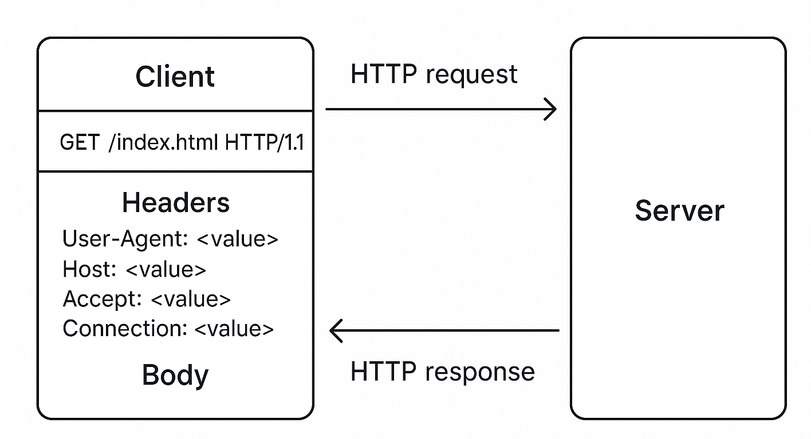
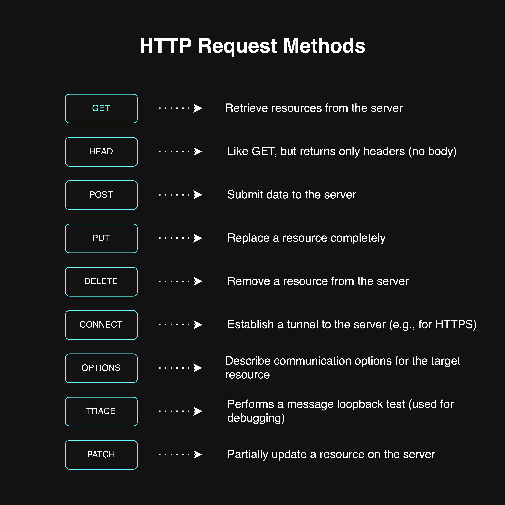

## What is an HTTP request?

An HTTP request is simply the message that a web browser or any other HTTP client sends to a server
to ask for something. such as, requesting data from the server, sending data to server and more
depending on the HTTP method used. The HTTP client forms this HTTP request and sends it to the
server through a network connection. usually after completing the DNS, TCP, and TLS precesses.

### HTTP Request Structure

 _HTTP
request structure_

An HTTP request has several parts. It starts with a request line like `GET /index.html HTTP/1.1`,
which includes the method (like GET or POST), the path, and the HTTP version. After that, there are
headers – key-value pairs like `User-Agent`, `Host`, `Accept`, `Connection`, and many more. These
headers give more context to the server about what the client wants or can handle. Depending on the
method used, the request may also contain a body, which is often seen in POST or PUT requests, where
data is being sent to the server (like a form submission).

The server receives this request, reads it, and sends back an HTTP response. That’s the basic
request-response cycle that drives the entire web.

### HTTP Request Methods

 _HTTP
request methods_

For a more information, refer to the documentation[^1].  
[^1]: [MDN Web Docs - HTTP Methods](https://developer.mozilla.org/en-US/docs/Web/HTTP/Reference/Methods)

## Evolution of HTTP - Quick Glance

HTTP didn’t appear overnight in the form we use today. It evolved through versions – starting from
HTTP/0.9, then 1.0, 1.1, 2, and now HTTP/3.

- HTTP/0.9: Very basic, only allowed GET method, and didn't even have headers.
- HTTP/1.0: Introduced headers and better structure, but lacked persistent connections.
- HTTP/1.1: Brought persistent connections and a lot of improvements.
- HTTP/2: Introduced multiplexing and better performance.
- HTTP/3: Built on QUIC protocol using UDP, still in adoption.

In this writing, I’m going to focus only on HTTP/1.1 and HTTP/2, because they are the most commonly
used versions on the web today. Most modern websites either run on HTTP/1.1 or HTTP/2. HTTP/3
adoption is growing but still not as dominant.

## HTTP/1.1 (Old reliable version)

So with HTTP/1.1, there’s one key thing to remember, it doesn’t support multiplexing. That means a
single TCP connection can handle only one HTTP request at a time. Let’s say the browser establishes
a TCP connection with the server. It sends one request and waits for the response. Only after
getting the response, it can send the next request through that same connection.

Now websites aren’t just a single file anymore. A single HTML file usually references dozens of
other resources like CSS files, JS files, images, fonts, etc. So browsers can’t wait for one-by-one
serial requests. To improve the speed, browsers try to open multiple TCP connections in parallel to
the same domain. But there’s a limit, the browser allows only up to 6 concurrent TCP connections per
domain.

What if a webpage needs to load 13 resources from the same domain? Well, the browser opens 6 TCP
connections and starts fetching the first 6 resources in parallel. The remaining 7 are just queued
up. As soon as one of those 6 connections finishes and becomes free, the browser uses it to fetch
the next resource. This waiting mechanism slows down the page load. It’s like having 6 delivery
bikes for 13 packages. Until one comes back, the rest have to wait.

This also leads to more usage of system resources. More sockets opened, more TLS handshakes needed
for each new connection, and more ALPN negotiations every time a secure connection is established.
All of that is not efficient.

Back in the days before HTTP/2 became popular, developers used some tricks to bypass this 6
connection limitation. One way was subdomain sharding. Loading some resources from img.example.com,
some from cdn.example.com, and some from the main domain. That way the browser could open more
connections across different subdomains. Another method was using CDNs that serve static content
from other domains. You could also change browser settings to increase the limit (but not
recommended). And of course, the most effective solution is to upgrade to HTTP/2 or 3.

Do I think it's worth mentioning these tricks? Honestly yes, but only to show how devs had to fight
against HTTP/1.1's limitations before better protocols came along. Most modern websites and browsers
use HTTP/2, so these tricks are less useful now. But they do tell the story of how things evolved.

## HTTP/2 (upgraded version)

Now HTTP/2 came to fix most of HTTP/1.1's limitations. The biggest win is multiplexing. It allows
multiple HTTP requests and responses to be sent at the same time over a single TCP connection. That
means no more need to open extra TCP connections to the same domain. No more queuing like in
HTTP/1.1.

So in our earlier example, even if there are 13 resources to load, all of them can be sent together
in a single connection. Parallelized and efficient. No blocking, no delays. This improves
performance massively, especially for complex websites.

HTTP/2 also brings in binary framing, header compression (HPACK), and even server push (where server
sends files before client asks: though this isn’t heavily used nowadays). But the main star here is
multiplexing. It changes everything.

Under the hood, HTTP/2 still uses TCP. And if it's running over TLS, then ALPN is used during the
TLS handshake to decide whether the connection should use HTTP/1.1 or HTTP/2.

## Keep-Alive Header: HTTP/1.1 vs HTTP/2

With HTTP/1.1, the Connection: keep-alive header is necessary if you want to reuse a TCP connection
for multiple requests. If you don’t use it, the connection closes after each request. But even with
keep-alive, HTTP/1.1 still only allows one active request per connection. So it avoids
re-handshakes, but it still can't handle true parallelism.

In HTTP/2, this concept is built-in. There’s no need for keep-alive headers. The connection stays
alive by default and multiplexing takes care of everything. It’s smarter and doesn’t rely on manual
headers to stay efficient.

## Client and server must agree on HTTP version

Other Domains = New TCP Connections

Whether you use HTTP/1.1 or HTTP/2, if your main HTML file includes resources from other domains:
let’s say fonts from Google Fonts or scripts from a CDN, the browser has to create new TCP
connections to those domains. Each domain means a fresh TCP connection, a separate TLS handshake,
and a new ALPN negotiation.

So even if HTTP/2 saves you from multiple connections to the same domain, it can’t help with
third-party resources. That’s why reducing third-party dependencies also helps improve load times.

## Inspecting HTTP version

You can check the HTTP version used by a site using terminal commands or browser DevTools.

From the terminal:

```bash
curl -I https://kavindujayarathne.com
```

If you want verbose output:

```bash
curl -vI https://kavindujayarathne.com

```

Using curl you can force the http version also:

```bash
curl -I --http1.1 https://kavindujayarathne.com → forces HTTP/1.1
curl -I --http2 https://kavindujayarathne.com → forces HTTP/2

```

From the browser:

Open DevTools → Network tab → Reload the page → Look under the 'Protocol' column to see which HTTP
version is used for each resource.
