You guys might know in the modern world, encryption is everywhere, from HTTPS to secure messaging,
blockchain, password vaults, VPNs, and beyond. When it comes to encryption, there are two concepts
that we need to talk about, which are symmetric encryption and asymmetric encryption. We can define
them as the fundamental building blocks of all modern cryptography.

Let’s talk about them…

## What does it mean by Symmetric Encryption?

Symmetric encryption means you encrypt or decrypt something using just a single passphrase. If you
want more clarity there, that means there are no multiple keys or passphrases separately for
encryption and decryption. It’s just a single passphrase that is used for both encryption and
decryption. So anyone who knows the passphrase can decrypt the encryption. It’s easy, fast, and
simple.

Here are some examples of symmetric encryption algorithms:

- AES
- ChaCha20
- Blowfish

Generally, Wi-Fi encryption (WPA2), VPN tunnels, BitLocker, ZIP file encryption, those sorts of
things use symmetric encryption.

### Symmetric encryption with GPG

Let’s try out how symmetric encryption works.

First, I’m going to create a file called `secret.txt` with a random message in it.

For that, I use the below command.

```bash
echo "Secret Message" > secret.txt

```

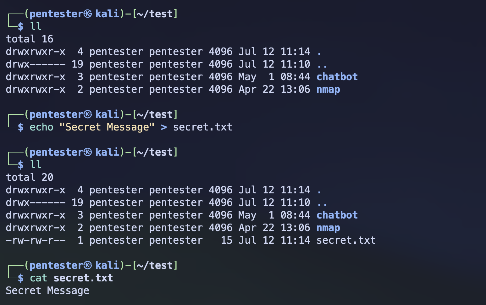
_Source by author_

Now you can encrypt the `secret.txt` file with the below command.

```bash
gpg --symmetric secret.txt

```

With the above command, it will ask for a passphrase before it completes the encryption, and that
passphrase is what’s going to be used for both your encryption and decryption.

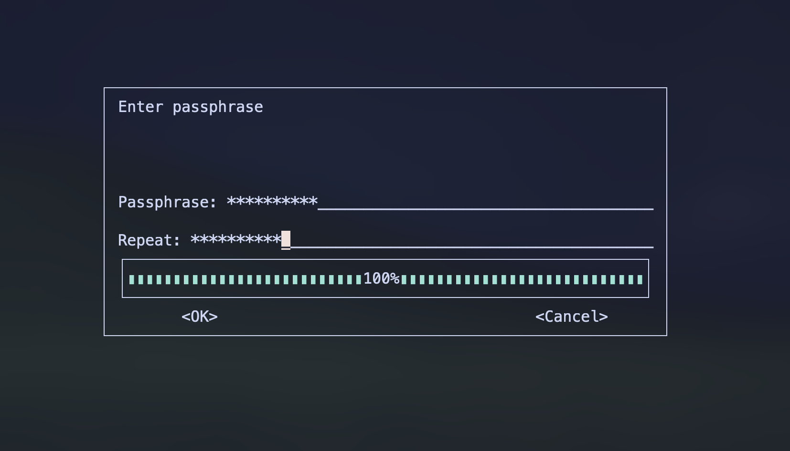 _Source by author_

After the passphrase, it creates the `secret.txt.gpg` file, which is the encrypted `secret.txt`
file. And that’s it for encryption.

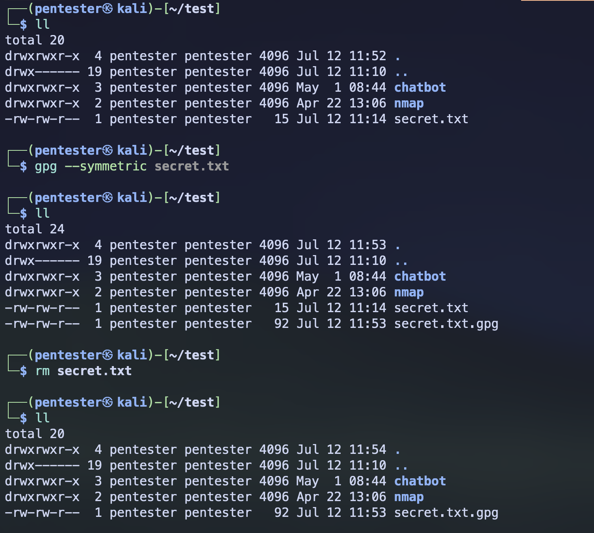
_Source by author_

You can see whether it's been encrypted or not by going inside the file using an editor

```bash
vim secret.txt.gpg

```


_Source by author_

Now, if you want to decrypt this file, you can simply do it by running the below command.

```bash
gpg --decrypt secret.txt.gpg

```

And it will ask for the same passphrase that you set when you encrypted the file, and that’s it.

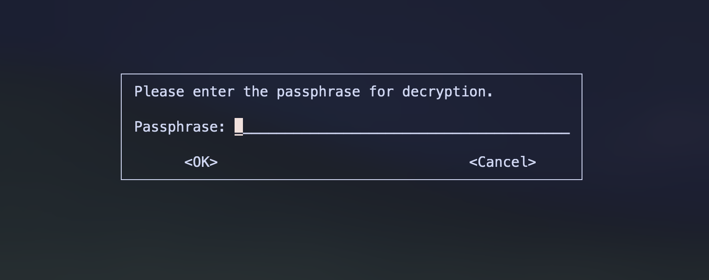
_Source by author_

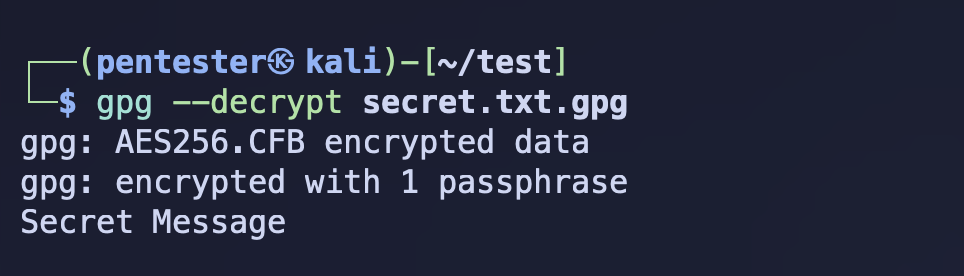
_Source by author_

If you want to save the output to another file, then you can use the `--output` flag with the name
of the file.

```bash
gpg --output decrypted-secret.txt --decrypt secret.txt.gpg

```

## What does it mean by Asymmetric Encryption?

This is the opposite of symmetric encryption. Asymmetric encryption means it involves two keys: a
public key and a private key. You use the public key for encryption and the private key for
decryption. Slightly more weighted than symmetric encryption.

Here are some examples of asymmetric encryption algorithms:

- RSA
- ChaCha20
- ElGamal

These algorithms are based on hard mathematical problems.

Generally, they are used in SSL/TLS (HTTPS), GPG, SSH, auth protocols, and more…

### Asymmetric encryption with GPG

This is just a practical example that shows how asymmetric encryption works.

Here is our file that we’re going to encrypt.

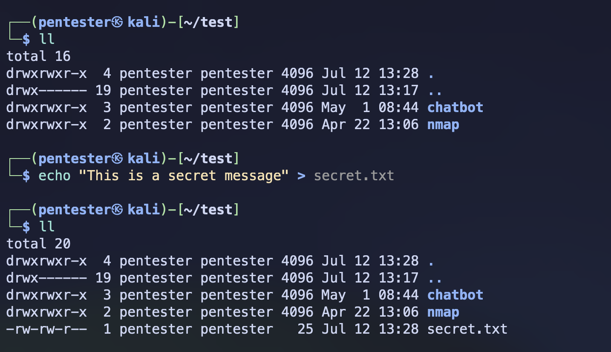 _Source by
author_

In asymmetric encryption, as you already know, it involves two key pairs separately for encryption
and decryption. First, you have to generate the full key pair before the encryption.

```bash
gpg --full-generate-key

```

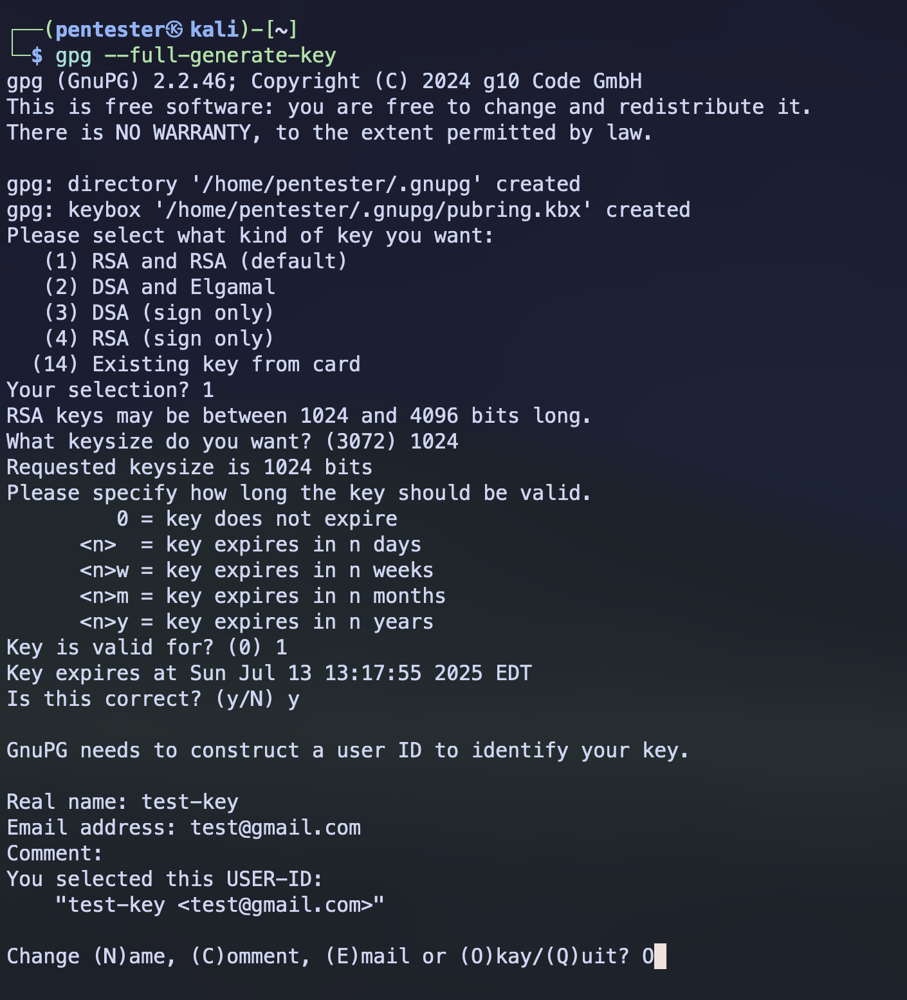
_Source by author_

After this, it will ask for a passphrase for your private keys. The purpose of this passphrase is to
protect your private keys. Even though someone has your private key, without the passphrase, nobody
can decrypt the file using that private key.

After the passphrase, it generates the full key pair.

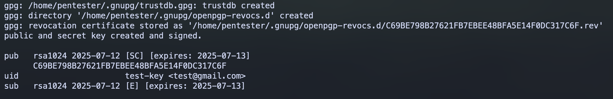
_Source by author_

If you want to specifically see the key pair, you can use these commands:

```bash
gpg --list-keys --fingerprint

```

```bash
gpg --list-keys --keyid-format=long

gpg --list-keys --keyid-format=short

```

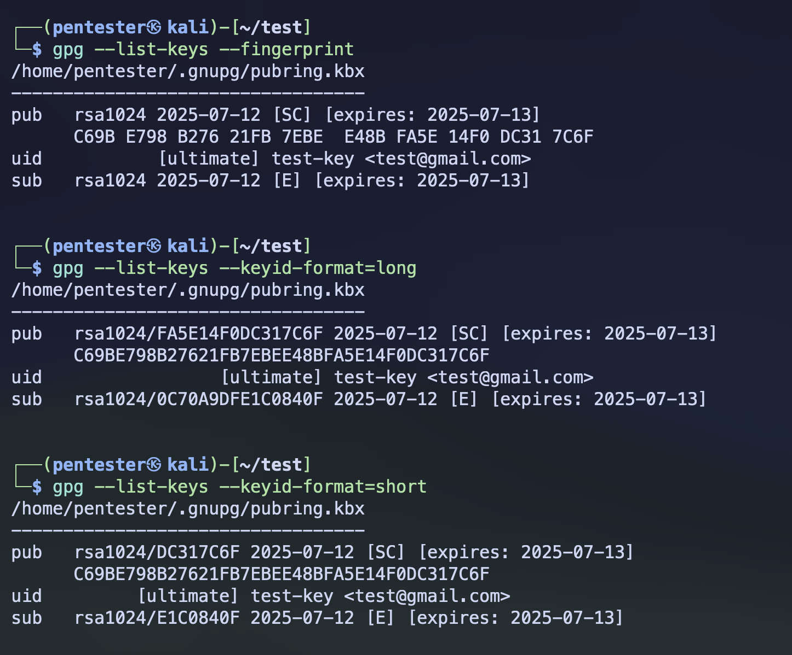 _Source by
author_

Once you’ve generated the key pair, now you can encrypt your file using your public key.

```bash
gpg --encrypt --recipient <fingerprint / keyid (long or short)> secret.txt

```

As the recipient, you can use the fingerprint of your key or key ID as your preference.

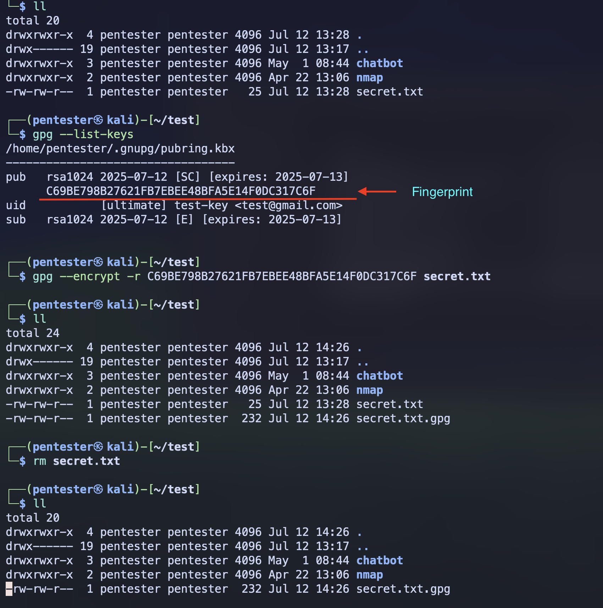
_Source by author_

If you want to decrypt the file, then just like we did in symmetric encryption, you can use the
below command.

```bash
gpg --decrypt secret.txt.gpg

```

Or if you want to take the output to another file, you can use the `--output` flag.

```bash
gpg --output decrypted-secret.txt --decrypt secret.txt.gpg

```

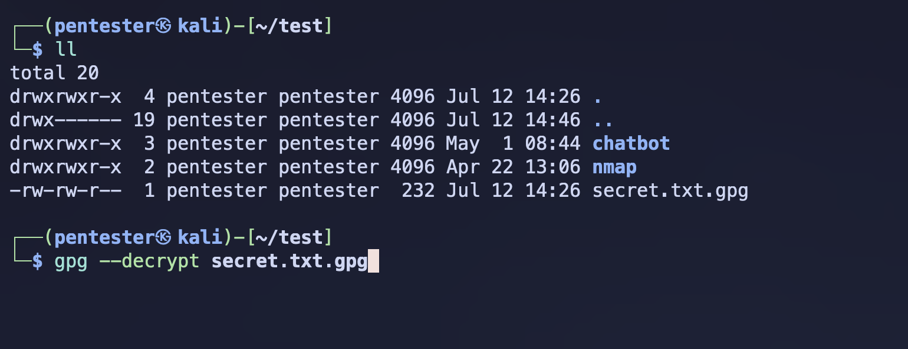
_Source by author_

When you execute the above command, it will ask for the passphrase. As I mentioned before, unlike
symmetric encryption, this passphrase is not for decryption. It’s for the protection of your private
key.

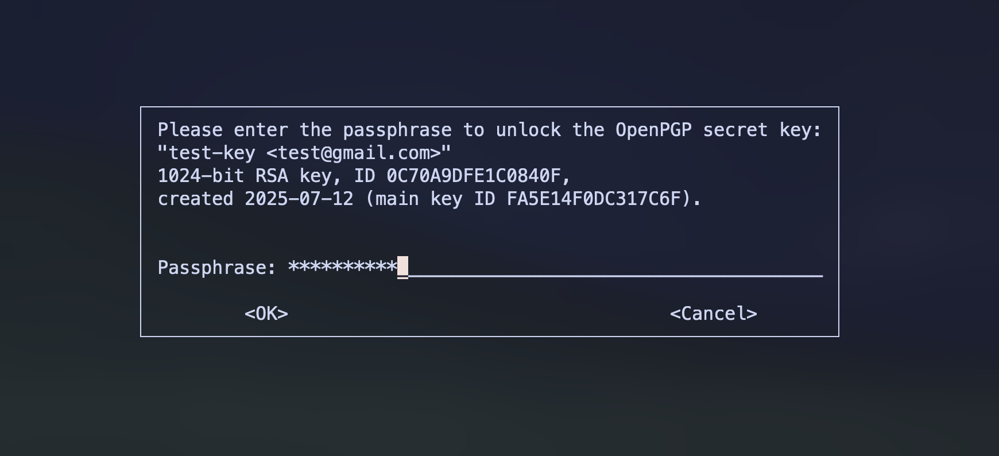
_Source by author_

After the passphrase, it decrypts your file using the private key.

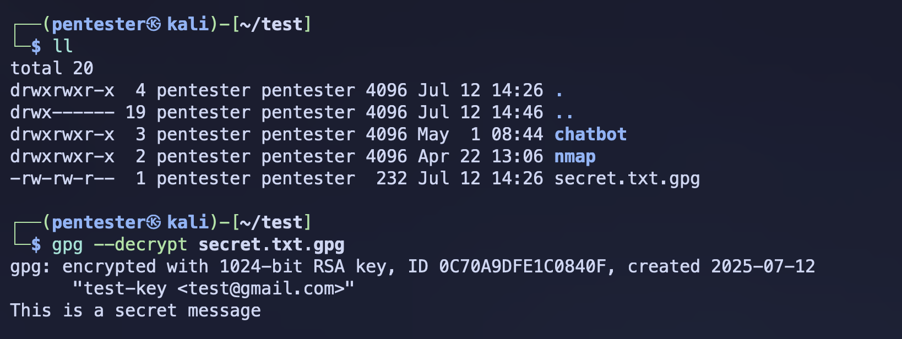
_Source by author_
