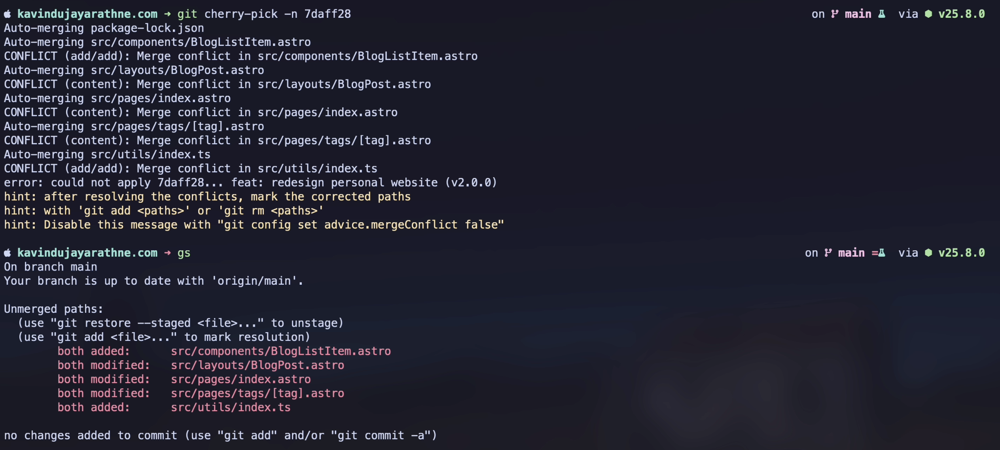

I use a local testing branch in my personal blog and that's where I handle all the changes and write
content to it. When I want to push some changes to production, I commit the relevant changes in a
separate commit, then stash the remaining changes, checkout to main, and from there I cherry-pick
that commit which includes the changes I want from testing branch, and push it to remote main.

A few days ago, I was doing the same. In the middle of the process, I got a merge conflict while I
was cherry-picking the commit from testing.

Under normal conditions, Git automatically merges files using a three-way merge algorithm.

Merge conflicts happen when Git cannot safely decide what the final file should look like. When two
branches try to change the same part of a file, it becomes a merge conflict because Git cannot
safely decide which part should be kept.

When this happens, we open the conflicted file and there we can see the markers. We can manually
change which part should be kept, whether it's the current branch's portion of changes or the
incoming changes.

But I found this while I was working on that.

Depending on what changes I want to keep, meaning whether it's the current branch's changes or the
incoming changes, we can use this command.

If you want to keep the changes from the current branch (HEAD),

```bash
git checkout --ours <path-to-conflicted-file>
```

If you want to keep the changes from the incoming commit,

```bash
git checkout --theirs <path-to-conflicted-file>
```

Once you are done, mark the conflict as resolved.

```bash
git add <path-to-conflicted-file>
```

If you have multiple files conflicted and you want all those files to get the changes from the
incoming commit,

```bash
git checkout --theirs .
git add .
```

Repeat the same thing the other way to keep the HEAD version for all the conflicted files.

If it fits your situation, this is the fastest way to resolve a merge conflict. We don’t have to
manually go through the file and do the changes manually..

Hope this helps…
