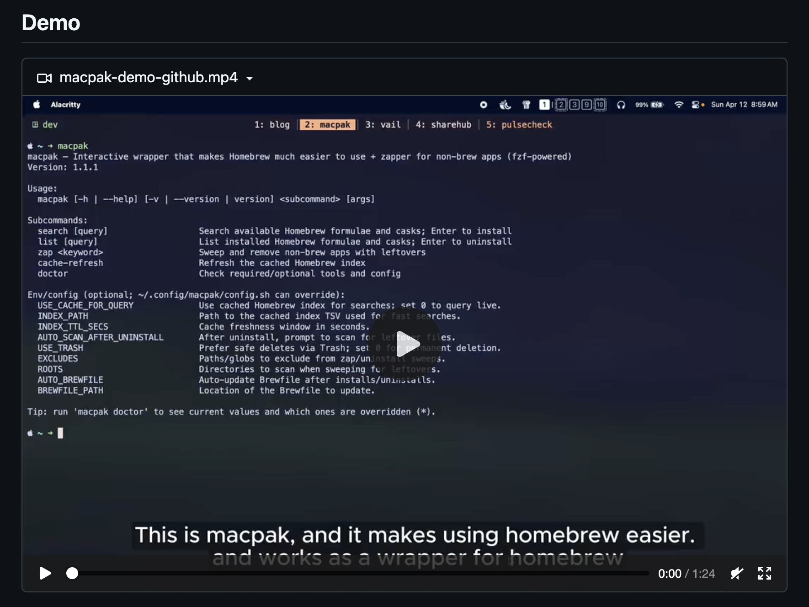
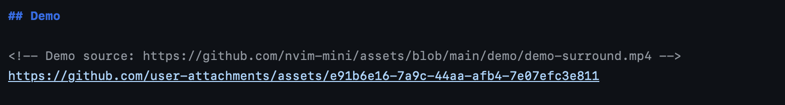
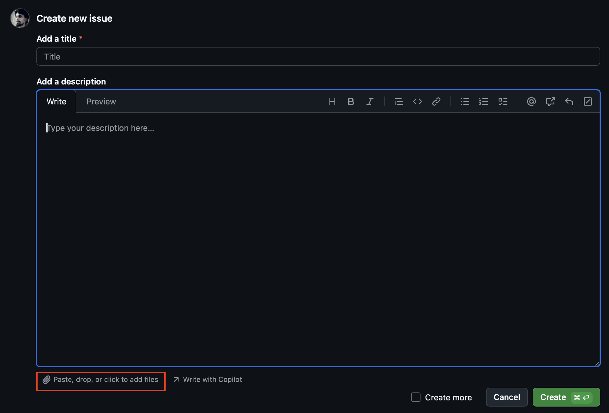
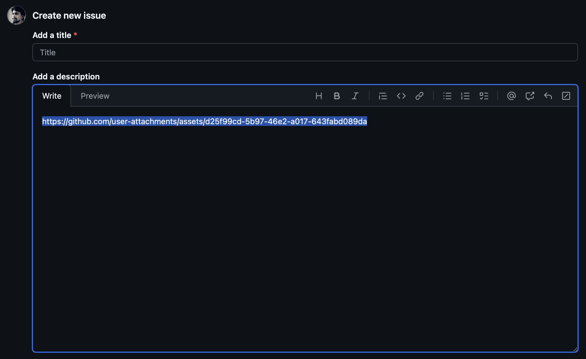

Recently, I was working with the [macpak](https://github.com/kavindujayarathne/macpak) CLI tool that
I built to ease the workflow of using Homebrew. I just wanted to add a demo video to its README.md
file, but GitHub is very strict with media files and their file sizes. What I was trying to add was
an MP4 file, but it failed due to its size. It wasn’t a heavy file, it was very lightweight, but
still failed. Then I tried a GIF around 20 MB in size, which is way larger compared to the
previously failed MP4 file. But for this GIF, it worked. The issue was that after I added that GIF,
when someone tried to access the repository, it lagged a bit and took a while to load that GIF.

That would definitely not be a good experience for the person trying to visit the repository.

I was about to give up on adding this media file and removed the GIF too, but suddenly I remembered
seeing, while working with open-source projects, that some of those projects had included demo
videos with the MP4 extension, and they were smooth, clear, and had no issues.

I thought to do a little research on them, and I found one of those repositories with this kind of
demo video included. I went straight to the repository’s README.md file and dug into what was going
on there, and I found this interesting detail.

There was something like.

 _Source:
https://github.com/nvim-mini/mini.surround/blob/main/README.md_

As you can see, the URL is not pointed to any media inside the repository. It’s something else.

I just tried to find out what this “user-attachments” thing is, and I found the
[Attaching files section inside the GitHub Docs](https://docs.github.com/en/get-started/writing-on-github/working-with-advanced-formatting/attaching-files).
From there, I could already imagine the solution.

## Solution

This is just a little trick that most open-source repositories and production-grade repos use to add
media files like demos and such things that we cannot achieve under normal circumstances inside the
README.md file.

In GitHub, we can add attachments like files, images, and videos to an issue or pull request
conversation. We can simply drag and drop, or attach files by clicking the attach icon below.

 _Attach icon_

When you add the file, it immediately uploads that file to GitHub and updates the text field with a
publicly accessible URL. You can use this URL anywhere you want.

 _URL_

Now, if you’re someone who’s concerned about even small things like me, the question you might get
is, these GitHub issues and PR conversations are meant for different purposes. Are we polluting them
with this trick?

Actually, we are not. The best part is that we don’t have to create any issues or PRs in this case.
What we only have to do is, if you use GitHub issues to get this URL, go to the Issues section
inside whatever repository you’re in and click on the “New issue” button. That will give you the
template to add a GitHub issue. Then drag and drop your attachment into the text field below, the
one you want to upload to GitHub and access via URL. And it immediately uploads it to GitHub and
shows you the URL. You can copy it and cancel the issue. That’s it.

Even though you canceled it, by that time it has already uploaded to GitHub, and you can access it
anywhere with that URL.

You can simply paste that URL into your README, and it will show the demo as you expected.

It not only shows the demo but also gives you some nice UI elements in your README file, such as a
collapse and expand icon.

When it comes to adding these media files, there are some conditions and limitations in terms of
file sizes and formats.

You should read the
[Attaching files section in the GitHub Docs](https://docs.github.com/en/get-started/writing-on-github/working-with-advanced-formatting/attaching-files)
for more information.
