## Preview

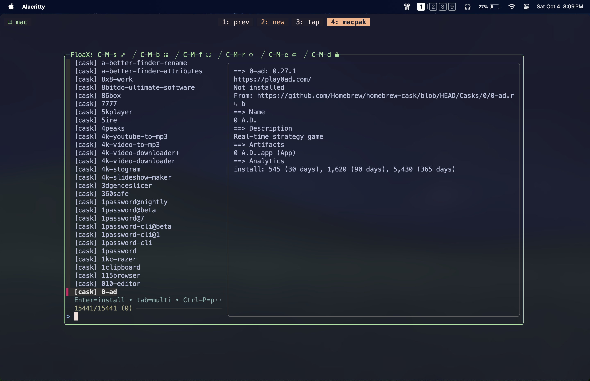

## How it all started..

I’ve always had this idea of making my MacBook entirely reproducible. If I got a new MacBook or if I
happened to format my current one, when I set it up again, if I had a single script that I could run
and it would do everything for me, what a pleasurable experience that would be. I was always one
step closer to that. I already have my dotfiles managed in GitHub. But I want more than that. The
goal is to build an entirely reproducible system.

I use Homebrew as my package manager, like most Mac users. If I create that reproducible system, for
now I’m thinking of using a Brewfile to track all the packages I currently have installed, and that
would be the file I use inside my reproducible system to install all the formulas and casks.

But currently, I have to manually update the Brewfile with the command below after every brew
installation and uninstallation if I want to keep it up to date.

```bash
brew bundle dump --file="Brewfile/path" --force
```

Every time I install or uninstall something with brew, that’s extra effort, and in the long run,
that would never work.

So I wanted to write a script for that. Whenever I want to install or uninstall something with brew,
I just run the script, and it will do the installation or uninstallation, and by the end, it will
update the Brewfile as well. That was the idea.

It all started with that simple idea, but I don’t know, the idea grew while I was developing it, and
that’s how macpak was born.

macpak is no longer just a script to update the Brewfile. It’s an entire formula and a Homebrew
wrapper that can be used to search through the brew catalog with interactive `brew info` previews,
install and uninstall single or multiple selected packages, remove leftovers from brew and non-brew
packages, and do many other useful things on macOS.

## After finished the initial script

After I finished my script, the next thing was to decide how I was going to publish it. I’ve had the
idea of creating a Homebrew tap for this CLI tool since the very beginning, so I could make a single
repository and manage it as both the main repo for this tool and the Homebrew tap. But that could
very easily lead to a cluttered environment.

So I wanted something more organized, easier to maintain, and less cluttered.

For clarity and ease of maintainability, I thought I’d go with two repositories: a main repository
and another one for the Homebrew tap. And I’ve always wanted to work with GitHub workflows in a
production-grade repository. See, it’s one spark, two flames. Life is so satisfying sometimes, isn’t
it?…

That way I can keep both repositories separate, and I can write GitHub workflows to trigger and
update the Homebrew tap when I create a GitHub release by pushing a tag to the main repository. So I
can have some fun with GitHub workflows there.

## Structuring the whole project (main repository)

Once I decided that, the next step was to split my script into multiple maintainable pieces known as
modules, because I had written it as a single big script. If I had kept it that way, it would have
been very hard to maintain. It was already almost 650 lines long, and with future implementations,
it could easily grow beyond that…

This is the final structure of the main repository:

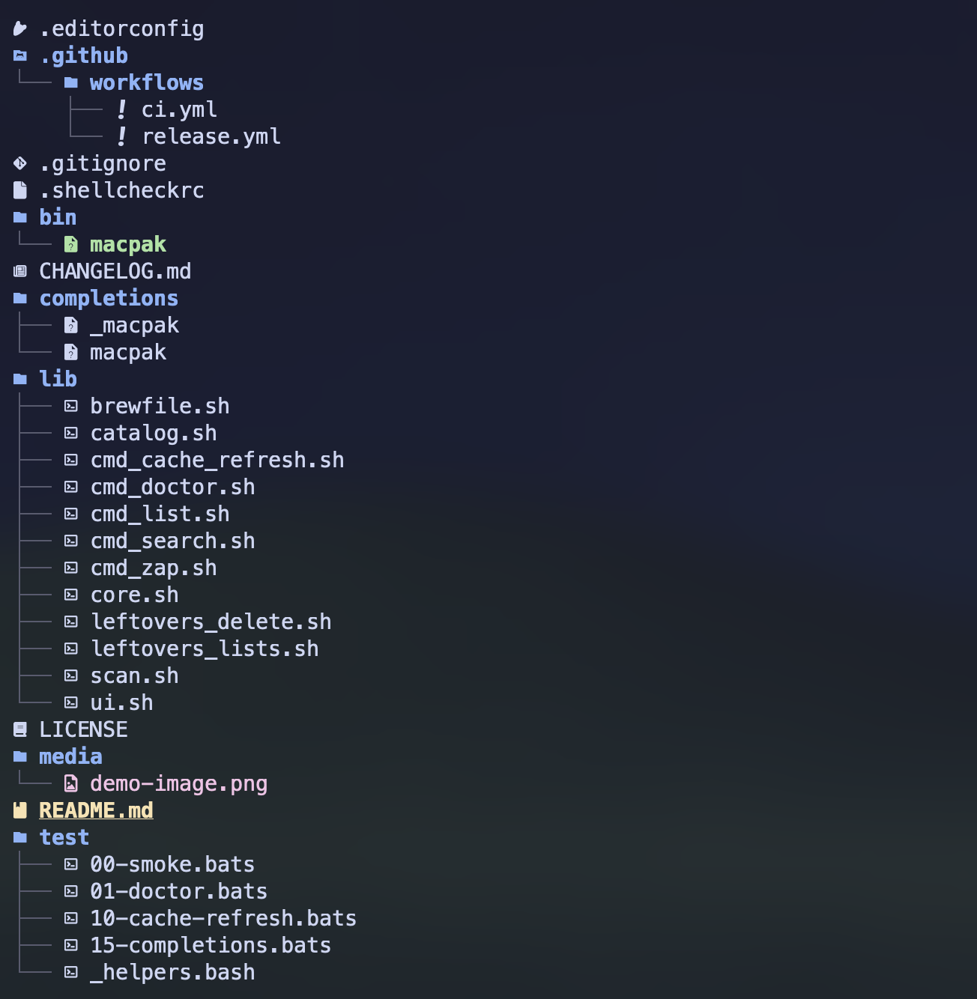 _Project
Structure_

I divided the script into two main folders:

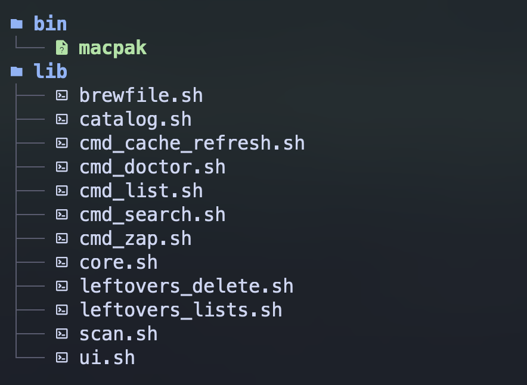 _bin/ folder and
lib/ folder_

The **bin** folder is where the driver exists, which is the main macpak script. I can’t call it a
binary because it’s not. It’s the main shell file that calls and sources all the other shell scripts
(aka modules) inside the **lib** folder.

This is how `bin/macpak` looked at first:

```bash
#!/usr/bin/env bash
set -euo pipefail

# Resolve lib dir relative to this file
SCRIPT_DIR="$(cd -- "$(dirname -- "${BASH_SOURCE[0]}")" && pwd)"
LIB_DIR="${MACPAK_LIBDIR:-"$SCRIPT_DIR/../lib"}"

# Source modules
. "$LIB_DIR/core.sh"
. "$LIB_DIR/cmd_doctor.sh"
. "$LIB_DIR/ui.sh"
. "$LIB_DIR/catalog.sh"
. "$LIB_DIR/leftovers_lists.sh"
. "$LIB_DIR/leftovers_delete.sh"
. "$LIB_DIR/brewfile.sh"
. "$LIB_DIR/scan.sh"
. "$LIB_DIR/cmd_search.sh"
. "$LIB_DIR/cmd_list.sh"
. "$LIB_DIR/cmd_zap.sh"
. "$LIB_DIR/cmd_cache_refresh.sh"

# Dispatcher
case "${1:-}" in
-h | --help | '')
	usage
	exit 0
	;;
-v | --version | version)
	print_version
	exit 0
	;;
doctor)
	shift
	cmd_doctor
	;;
search)
	shift
	cmd_search "$@"
	;;
list)
	shift
	cmd_list "$@"
	;;
zap)
	shift
	cmd_zap "$@"
	;;
cache-refresh)
	cmd_cache_refresh
	;;
*)
	echo "$APP_NAME: unknown command '$1'" >&2
	echo "Run '$APP_NAME --help' for usage." >&2
	exit 1
	;;
esac
```

But as you can see, there’s an issue with the way I wrote it. It’s a bit inefficient, if you noticed
it.

With this setup, even if I just wanted to check the version with `macpak --version`, it would source
all the modules just to print the version, which adds latency and is pretty inefficient.

So I thought I’d rewrite it so that it only sources the necessary modules according to the executed
command.

This is how I did it:

```bash
#!/usr/bin/env bash
set -euo pipefail

# Resolve lib dir relative to this file
SCRIPT_DIR="$(cd -- "$(dirname -- "${BASH_SOURCE[0]}")" && pwd)"
LIB_DIR="${MACPAK_LIBDIR:-"$SCRIPT_DIR/../lib"}"

# Source Always needed modules
. "$LIB_DIR/core.sh"

# Dispatcher
case "${1:-}" in
-h | --help | '')
	usage
	exit 0
	;;
-v | --version | version)
	print_version
	exit 0
	;;
doctor)
	. "$LIB_DIR/cmd_doctor.sh"
	cmd_doctor
	;;
search)
	shift
	. "$LIB_DIR/ui.sh"
	. "$LIB_DIR/catalog.sh"
	. "$LIB_DIR/brewfile.sh"
	. "$LIB_DIR/cmd_search.sh"
	cmd_search "$@"
	;;
list)
	shift
	. "$LIB_DIR/ui.sh"
	. "$LIB_DIR/scan.sh"
	. "$LIB_DIR/leftovers_lists.sh"
	. "$LIB_DIR/leftovers_delete.sh"
	. "$LIB_DIR/brewfile.sh"
	. "$LIB_DIR/cmd_list.sh"
	cmd_list "$@"
	;;
zap)
	shift
	. "$LIB_DIR/ui.sh"
	. "$LIB_DIR/scan.sh"
	. "$LIB_DIR/leftovers_lists.sh"
	. "$LIB_DIR/leftovers_delete.sh"
	. "$LIB_DIR/cmd_zap.sh"
	cmd_zap "$@"
	;;
cache-refresh)
	. "$LIB_DIR/ui.sh"
	. "$LIB_DIR/catalog.sh"
	. "$LIB_DIR/cmd_cache_refresh.sh"
	cmd_cache_refresh
	;;
*)
	echo "$APP_NAME: unknown command '$1'" >&2
	echo "Run '$APP_NAME --help' for usage." >&2
	exit 1
	;;
esac
```

Moreover, I decided to add two GitHub workflows, ci.yml and release.yml. I’ll talk about them
further in the next section.

The other thing was, I really wanted to add shell completions to this tool.

You wanna hear some fun facts?

It was way harder than even writing the script to get these shell completions working 😂. I ended up
spending way too much time there because the debugging process was hell for me, and it was really
hard to make it work. Honestly, I first had to figure out how shell completions actually work and
how I could test them locally.

Then, as another major addition to the repo structure, I included some tests. I just wrote a few at
first, mainly because I’m about to automate most of this repository’s work and its releases. So I
thought it would be good, and easier for me, if I had some tests. That way, when I do releases or
push something to main, if there’s something wrong or if I’ve done something stupid like I usually
do when I’m out of my mind, I’ll know before it breaks any official release of macpak.

As a minor addition, I’ve added a `.editorconfig` file, which I’ve kept blank for now. It’s there to
maintain consistency across different editors, especially useful for open source projects where
people contribute to the code.

Another thing I added is a `CHANGELOG.md` and a `.shellcheckrc`, which is the config file for
ShellCheck.

All the other things in this main repo are pretty common in open source repositories, so I’m not
going to talk about all of them.

The special thing about this `CHANGELOG.md` file is that I use it for its usual purpose, letting
users know what’s new, what bugs were fixed (if any), and other updates. But I also use it to craft
the release notes when I publish a tag through GitHub. I’ve automated that part inside the release
workflow, which I’ll probably talk about later under the workflow section.

## Shell Completions

I’ve added shell completions only for bash and zsh for macpak.

### \_macpak

This is the zsh shell completion file. The underscore before the name is actually part of zsh’s
convention for naming completion scripts.

```zsh
#compdef macpak

_macpak() {
  local -a flags
  flags=(
    '--help:Show help information'
    '-h:Show help information'
    '--version:Show version information'
    '-v:Show version information'
  )

  local -a subcommands
  subcommands=(
    'search:Search available Homebrew formulae and casks'
    'list:List installed Homebrew formulae and casks'
    'zap:Sweep and remove non-brew apps with leftovers'
    'cache-refresh:Refresh the cached Homebrew index'
    'doctor:Check required/optional tools and config'
  )

  # 1st word after macpak -> subcommand
  # 2nd word -> that subcommand's argument
  # 3rd word -> stop (don’t offer flags again)
  _arguments -C \
    '1:subcommand:->subcmd' \
    '2:argument:->arg' \
    '3:: :->stop' && return 0

  case $state in
    subcmd)
      _describe -t macpak_choices 'Subcommands' subcommands
      _describe -t macpak_choices 'Flags'       flags
      return 0
      ;;

    arg)
      local subcmd=$words[2]

      case $subcmd in
        list)
          if (( $+commands[brew] )); then
            local -a names
            names=(${(f)"$(brew list 2>/dev/null)"})
            _values 'installed package' $names
          fi
          ;;

        search|zap|cache-refresh|doctor)
          ;;

        *)
          ;;
      esac
      return 0
      ;;

    stop)
      return 0
      ;;
  esac
}

# compdef _macpak macpak
```

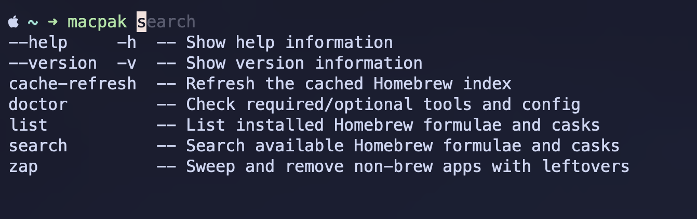 _zsh completions_

### macpak

This is the bash shell completion file.

```bash
# shellcheck shell=bash

_macpak_completion() {
  local cur
  cur="${COMP_WORDS[COMP_CWORD]:-}"

  local flags="-h --help -v --version"
  local subcmds="search list zap cache-refresh doctor"

  if (( COMP_CWORD == 1 )); then
    # shellcheck disable=SC2207
    COMPREPLY=( $(compgen -W "$flags $subcmds" -- "$cur") )
    return 0
  fi

  case "${COMP_WORDS[1]}" in
    list)
      if (( COMP_CWORD == 2 )) && command -v brew >/dev/null 2>&1; then
        local names
        names="$(brew list 2>/dev/null)"
        # shellcheck disable=SC2207
        COMPREPLY=( $(compgen -W "$names" -- "$cur") )
      else
        COMPREPLY=()
      fi
      ;;
    search|zap|cache-refresh|doctor)
      COMPREPLY=()
      ;;
    *)
      COMPREPLY=()
      ;;
  esac
}

# Register the function for macpak
complete -F _macpak_completion macpak
```

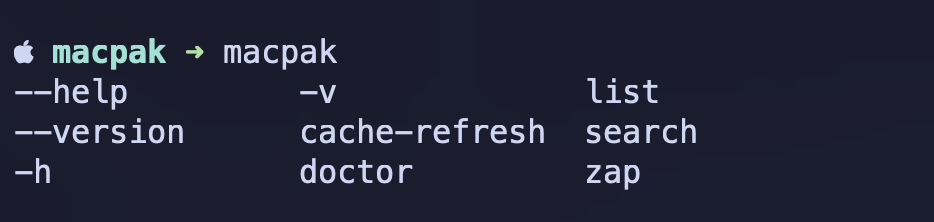 _bash completions_

If you compare the two, the zsh one and the bash one, you’ll notice that the bash version is very
straightforward. As far as I know, we can’t really do fancy things there like adding descriptions to
flags and subcommands.

But if you look at the zsh completion file I wrote, you’ll see that I’ve included descriptions for
the commands as well, which makes it more informative.

## shellchecks

Adding ShellCheck was also a fun experience, mainly because of the automations and because this is
an open source project. Every push, pull request, and tag release now goes through ShellCheck. This
makes it easier for me to maintain the project, catch abnormal implementations and mistakes, and
ensure best practices are followed throughout the codebase.

## Tests

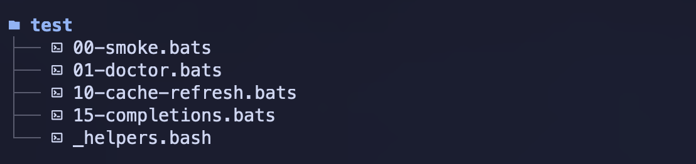 _test bats_

Listen guys, I just thought about it a little bit, whether I really need to write test cases
covering all the functionalities of macpak. I’d love to, but when I think about it, it’s damn hard
to cover the entire thing because, let’s say the `macpak search` command. If I write test cases to
cover this entire command, then I’d have to mock fzf, and we can simulate the index file with a
couple of items inside it, and that’s doable. That’s the basic layer. But after that, it comes
selecting packages from the list, and then it moves to the installation process. In the installation
process, we have single and multiple installation support, and then it updates the Brewfile. And if
it were the `macpak list` command, then I’d have to write test cases to cover the leftovers
selection phase as well. Likewise, it has nested layers.

I guess it’s not worth the time and effort required to write test cases covering all the
functionalities in this scenario, and there is no need for that either. Because in the normal
development process, most things get covered, and this is a small CLI tool. So I thought checking
only the basic and essential parts would be enough.

If you’re wondering about the numerical values at the start of each test file name under the test
folder, right, that’s again something interesting.

Those are numeric prefixes that define the order in which they should be executed.

Nice, isn’t it?

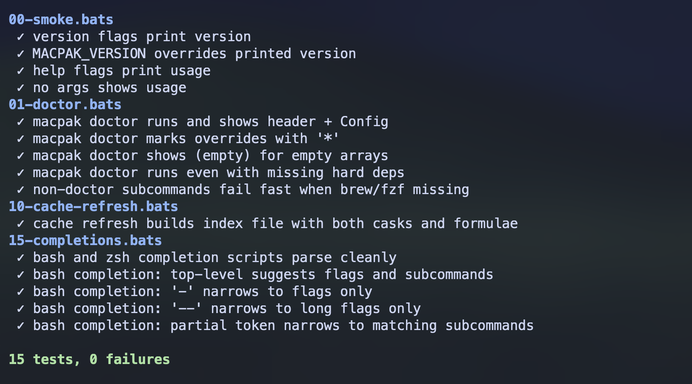 _BATS output_

## GitHub Workflows

All right guys… here we’ve reached the climax of all this fun.

This was the most exciting experience for me throughout the whole project: writing GitHub workflows.

As I’ve already mentioned earlier in this writing, I was about to automate most of the things in
this project.

The best part of it is automating the workflow between the main repository and the Homebrew tap of
this macpak CLI tool. When I push a tag to my main repository, it should be updated on the Homebrew
tap as well, because I don’t want to do it manually. Yes, of course, that’s what automations are
for…

So I wrote two GitHub workflows.

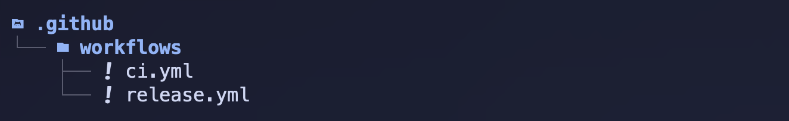 _github workflows_

`ci.yml` runs the basic linting and test cases, and it triggers on every push and pull request to
the main repository. Plus, I’ve included a small smoke run there as well.

```yml
name: CI

on:
  push:
    branches: [main]
  pull_request:
    branches: [main]

jobs:
  test:
    runs-on: macos-latest

    steps:
      - name: Checkout
        uses: actions/checkout@v4

      - name: Install tooling
        run: |
          brew update
          brew install fzf shellcheck bats-core

      - id: lint
        name: Lint
        run: |
          shellcheck -x bin/macpak completions/macpak
          if find lib -type f -name '*.sh' -print -quit | grep -q .; then
            find lib -type f -name '*.sh' -print0 | xargs -0 shellcheck -x
          fi
          zsh -n completions/_macpak

      - id: bats
        name: Unit tests (bats)
        run: |
          bats --print-output-on-failure test/

      - id: smoke
        name: Smoke run
        env:
          MACPAK_VERSION: 0.0.0
        run: |
          ./bin/macpak -v
          ./bin/macpak --help
          ./bin/macpak doctor || true

      - name: CI summary
        if: always()
        run: |
          {
            echo "## macpak CI summary"
            echo ""
            echo "| Step   | Result |"
            echo "|--------|--------|"
            echo "| Lint   | ${{ steps.lint.outcome }} |"
            echo "| Tests  | ${{ steps.bats.outcome }} |"
            echo "| Smoke  | ${{ steps.smoke.outcome }} |"
            echo ""
            echo "> Overall job status: **${{ job.status }}**"
          } >> "$GITHUB_STEP_SUMMARY"
```

Additionally, I added a CI summary for myself. After it’s done, when I inspect it, I can easily
check which steps were successful and which steps were skipped due to failures. So yeah, it makes
life a bit easier.

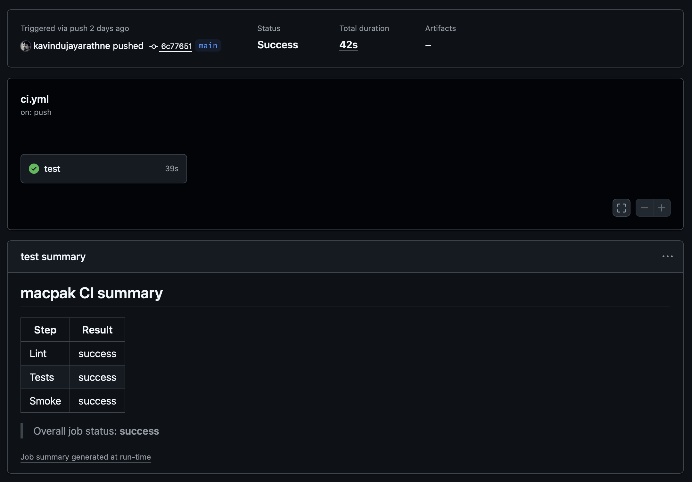 _ci.yml workflow summary_

`release.yml` is the workflow that does most of the heavy lifting, and it triggers every time I push
a tag to the main repository.

```yml
name: Release

on:
  push:
    tags:
      - 'v*.*.*'

permissions:
  contents: write
  pull-requests: write

jobs:
  release:
    runs-on: macos-latest

    steps:
      - name: Checkout
        uses: actions/checkout@v4
        with:
          fetch-depth: 0

      - name: Install tooling
        run: |
          brew update
          brew install fzf shellcheck bats-core

      - id: lint
        name: Lint
        run: |
          shellcheck -x bin/macpak completions/macpak
          if find lib -type f -name '*.sh' -print -quit | grep -q .; then
            find lib -type f -name '*.sh' -print0 | xargs -0 shellcheck -x
          fi
          zsh -n completions/_macpak

      - id: bats
        name: Unit tests (bats)
        run: |
          bats --print-output-on-failure test/

      - id: build
        name: Build tarball
        env:
          VERSION: ${{ github.ref_name }}
        run: |
          mkdir -p dist
          tar -czf "dist/macpak-${VERSION}.tar.gz" \
            bin lib completions LICENSE README.md CHANGELOG.md
          shasum -a 256 "dist/macpak-${VERSION}.tar.gz" > "dist/SHA256.txt"
          cat dist/SHA256.txt

      - id: notes
        name: Extract release notes from CHANGELOG
        env:
          VERSION: ${{ github.ref_name }}
        run: |
          set -euo pipefail
          mkdir -p dist
          VER="${VERSION#v}"
          awk -v ver="## [${VER}]" '
            BEGIN { p=0 }
            index($0, ver)==1 { p=1; next }
            p && /^## / { exit }
            p { print }
          ' CHANGELOG.md > dist/RELEASE_NOTES.md || true
          if [ ! -s dist/RELEASE_NOTES.md ]; then
            echo "::error::No changelog section for ${VER}. Update CHANGELOG.md before tagging (expected heading: '## [${VER}] - YYYY-MM-DD')."
            exit 1
          fi
          cat dist/RELEASE_NOTES.md

      - id: gh_release
        name: Create GitHub Release & upload assets
        uses: softprops/action-gh-release@v2
        with:
          tag_name: ${{ github.ref_name }}
          draft: false
          prerelease: false
          body_path: dist/RELEASE_NOTES.md
          files: |
            dist/macpak-${{ github.ref_name }}.tar.gz
            dist/SHA256.txt

      - id: tap_bump
        name: Auto-bump Homebrew tap formula
        env:
          COMMITTER_TOKEN: ${{ secrets.HOMEBREW_TAP_GITHUB_TOKEN }}
        if: ${{ env.COMMITTER_TOKEN != '' }}
        uses: mislav/bump-homebrew-formula-action@v2
        with:
          formula-name: macpak
          homebrew-tap: ${{ vars.TAP_REPO }}
          download-url:
            https://github.com/${{ github.repository }}/archive/refs/tags/${{ github.ref_name
            }}.tar.gz
          tag-name: ${{ github.ref_name }}
          commit-message: |
            macpak ${{ github.ref_name }}: bump formula to ${{ github.ref_name }}

      - name: Release summary
        if: always()
        run: |
          {
            echo "## macpak Release summary"
            echo ""
            echo "| Step        | Result |"
            echo "|-------------|--------|"
            echo "| Lint        | ${{ steps.lint.outcome }} |"
            echo "| Tests       | ${{ steps.bats.outcome }} |"
            echo "| Build       | ${{ steps.build.outcome }} |"
            echo "| Notes       | ${{ steps.notes.outcome }} |"
            echo "| GH Release  | ${{ steps.gh_release.outcome }} |"
            echo "| Tap Bump    | ${{ steps.tap_bump.outcome || 'skipped' }} |"
            echo ""
            echo "> Overall job status: **${{ job.status }}**"
          } >> "$GITHUB_STEP_SUMMARY"
```

It also runs inside a macOS runner. Because this is a macOS tool, I wanted to run it on a macOS
runner.

This also runs the linting and testing parts, which I already talked about when I mentioned the
ci.yml workflow.

After that initial run for linting and testing, it builds the tarball, which is what gets fetched by
the Homebrew tap when someone installs this through Homebrew.

Next, I had it extract the release notes from the CHANGELOG, so I don’t have to write separate
release notes for every release.

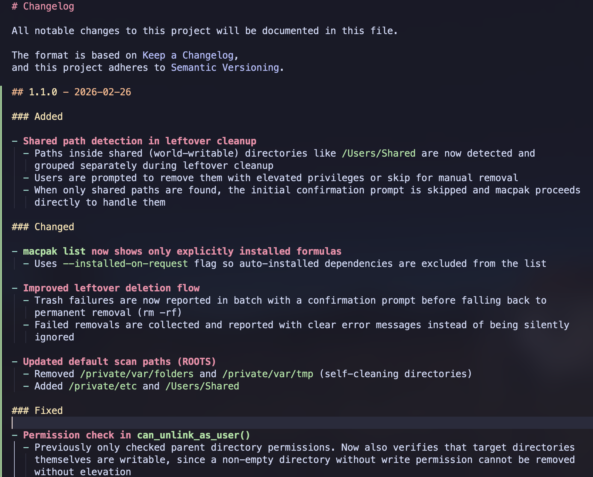 _CHANGELOG_

According to the tag version, it extracts only the matching section from the CHANGELOG, so I don’t
have to worry about anything.

In the next section, it creates the GitHub release and uploads the assets along with the release
notes.

Finally, it updates the tap repository, commits the changes with a commit message, and does
everything automatically.

I also have a separate CI summary section for the release.yml workflow, so I can easily track
successes and failures.

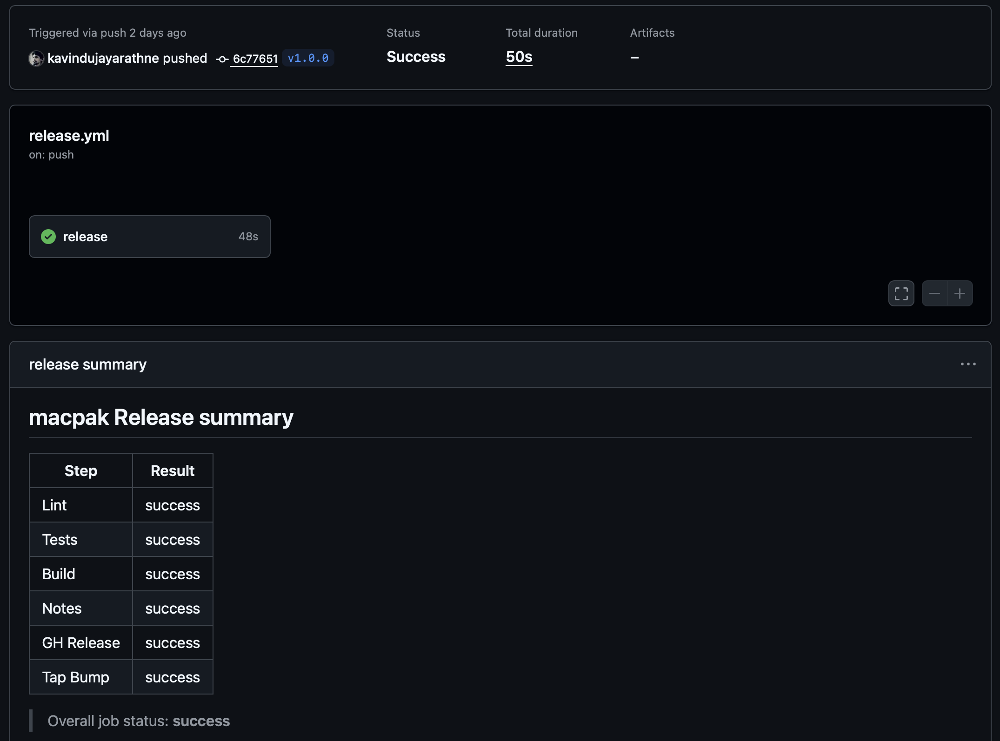 _release.yml workflow summary_

## Homebrew Tap

The initial idea was to add the macpak CLI tool to Homebrew. So I did a little research on how I
could add it to Homebrew so that anyone who wants to use this tool can easily install it via
Homebrew.

But as I understand it, there’s a procedure before adding it to Homebrew’s main repository. I’m not
completely sure about that part, to be honest.

Anyway, I decided to go with a Homebrew tap.

> **NOTE:**  
> If you don’t know what a Homebrew tap is, in Homebrew, we can tap external repositories, and then
> install and manage packages from them through Homebrew.

The Homebrew tap repository for macpak is called
[homebrew-macpak](https://github.com/kavindujayarathne/homebrew-macpak).

I don’t have much there. It has this Ruby file that I wrote, and it provides all sorts of
information relevant to Homebrew, like the description of the package, the main repository, the URL
to the build tarball, the sha256, and it even points to the head of the main repository in case you
want to install the head version.

It also specifies the dependencies this tool requires, along with installation instructions,
completion information, caveats, and finally, it includes some tests.

```ruby
class Macpak < Formula
  desc "Interactive Homebrew helper + leftover zapper for non-brew apps"
  homepage "https://github.com/kavindujayarathne/macpak"
  url "https://github.com/kavindujayarathne/macpak/archive/refs/tags/v1.0.0.tar.gz"
  sha256 "2342f60017c6acb77003ed31d9a79dd7c9a4baca04547619643ef73cebe4583f"
  license "MIT"
  head "https://github.com/kavindujayarathne/macpak.git", branch: "main"

  depends_on "fzf"

  def install
    libexec.install "lib", "bin/macpak"
    (bin/"macpak").write_env_script libexec/"macpak", {
      MACPAK_VERSION: version.to_s,
      MACPAK_LIBDIR:  "#{libexec}/lib"
    }

    bash_completion.install "completions/macpak"
    zsh_completion.install  "completions/_macpak"
  end

  def caveats
    <<~EOS
      Shell completions for macpak have been installed:

        zsh:  #{HOMEBREW_PREFIX}/share/zsh/site-functions
        bash: #{HOMEBREW_PREFIX}/etc/bash_completion.d

      If your shell already sources completions, these will be picked up automatically.
      For additional setup details, see the official Homebrew shell completion guide:
        https://docs.brew.sh/Shell-Completion

      Documentation:
        https://kavindujayarathne.com/blogs/macpak-documentation

      Story behind macpak:
        https://kavindujayarathne.com/blogs/journey-of-my-first-cli-tool
    EOS
  end

  test do
    out = shell_output("#{bin}/macpak --version").strip
    assert_match version.to_s, out
  end
end
```

And this is where it takes the information when you run the `brew info macpak` command as well.

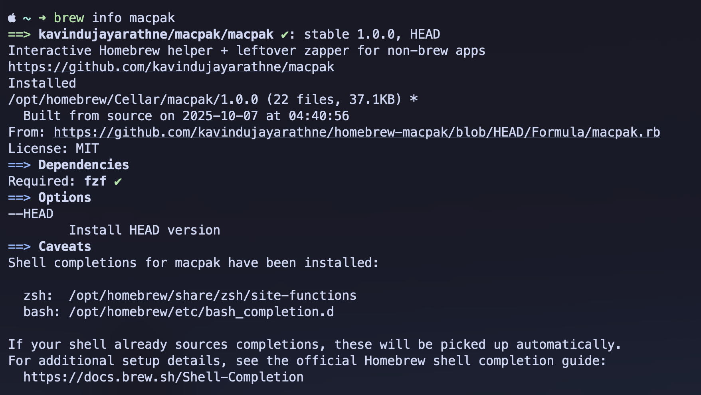 _brew info
macpak; command output_

All right, that’s it.

[macpak Main Repository](https://github.com/kavindujayarathne/macpak)  
[macpak Documentation](https://kavindujayarathne.com/blogs/macpak-documentation)  
[macpak Homebrew Tap Repository](https://github.com/kavindujayarathne/homebrew-macpak)

Enjoy using `macpak`!
